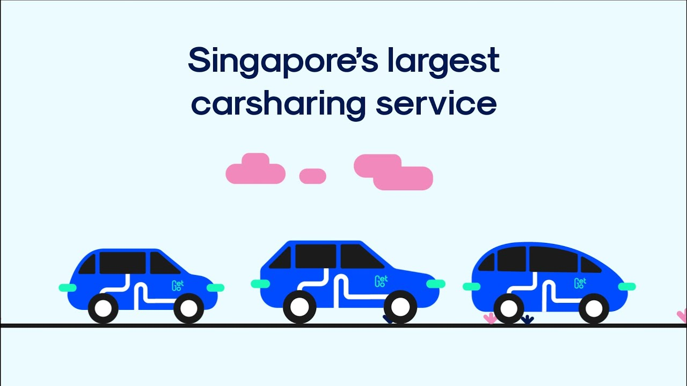
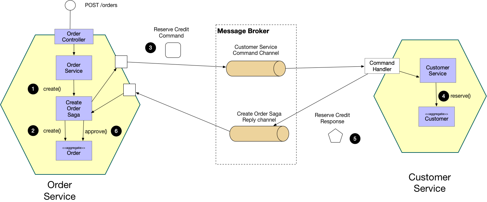
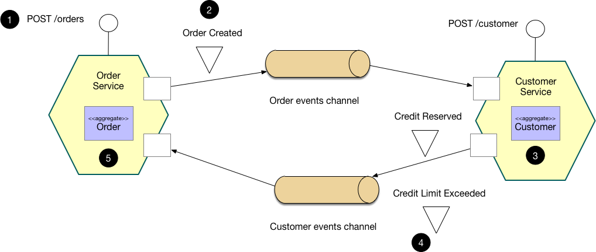

## GetGo Technologies

Earlier this year, I was approached by GetGo's CTO with an exciting opportunity that perfectly aligned with my experience and skill set - to migrate existing monolith to event driven microservices. GetGo is the largest carsharing service in Singapore, with over 2,600 cars across 1,500 locations island wide at the point of writing. The company's growth trajectory is not stopping and I'm eager to contribute to its continued success.

### Event Driven Architecture (EDA)

An event-driven architecture uses events to trigger and facilitate communication between decoupled microservices. Events are changes in state or updates, such as an item being placed in a shopping cart on an e-commerce website. These events can carry relevant state information (e.g., the purchased item, its price, and a delivery address) or serve as identifiers (e.g., a notification that an order has been shipped).

Event-driven architectures consist of three essential components: event producers, an event broker, and event consumers. Producers are responsible for publishing events to the event broker, which filters and forwards these events to the appropriate consumers. One of the key advantages of this architecture is the decoupling of producer and consumer services, allowing them to be independently scaled, updated, and deployed.

Some important EDA patterns include:
- [Event Sourcing](https://www.ibm.com/cloud/architecture/architectures/event-driven-event-sourcing-pattern)
- [Strangler](https://www.ibm.com/cloud/architecture/architectures/event-driven-strangler-pattern)
- [Database per service](https://microservices.io/patterns/data/database-per-service.html)
- [Command Query Responsibility Segregation (CQRS)](https://www.ibm.com/cloud/architecture/architectures/event-driven-cqrs-pattern)
- [Saga](https://www.ibm.com/cloud/architecture/architectures/event-driven-saga-pattern), which I will explain in greater detail below
- [Dead Letter Queue](https://www.ibm.com/cloud/architecture/architectures/event-driven-deadletter-queue-pattern)

### Pros & Cons of Event Driven Architecture

|Pros|Cons|
|-|-|
|Loose Coupling|Complexity|
|Real-Time Processing|Event Ordering|
|Fault Tolerance|Eventual Consistency|
|Less Technical Debt|Difficult to Troubleshoot|

### Event Broker: Why Solace?

GetGo has made the strategic decision to adopt Solace as its event broker, as highlighted in [this press coverage](https://finance.yahoo.com/news/leading-carsharing-getgo-selects-solace-130000049.html). This choice followed a comprehensive evaluation of various messaging brokers, with the conclusion that Solace's services are the most suitable for our specific use case. Solace offers a range of advanced features that align with our new requirements, including wildcard topic subscription, delayed delivery, microgateways, and more.

Here's a summary of the key differences between Kafka and Solace:

||Kafka|Solace|
|-|-|-|
|Consume|Consumer Polls|Pushed to Consumer|
|Exactly Once Delivery|Yes|No|
|Topic Partition|Yes|No|
|Consumer Groups|Yes|No|
|Wildcard Subscription|No|Yes|
|Delayed Delivery|No|Yes|
|Microgateways|No|Yes|
|Dead Letter Queue|No|Yes|

### Saga: Distributed Transactions
When architecting the new backend system, we had extensive discussion on executing distributed transactions that span across multiple services, by breaking it into a collection of subtransactions that can be interleaved in any way with other transactions.

When architecting our new backend system, we engaged in thorough discussions regarding the execution of distributed transactions that span across multiple services. Our approach involved breaking these transactions down into local subtransactions, which could be interleaved in a flexible manner with other transactions. This design, also known as Saga, allowed for greater flexibility and adaptability in managing complex transactional processes across our distributed system.

#### Centralized: Orchestration
In the centralized approach, the orchestrator, which is typically the initiating service, takes on the responsibility of coordinating the transaction. It communicates directly with all participating services, instructing them on what local transactions to execute and in what order. This approach provides a clear and centralized control mechanism for managing the entire transaction.

#### Decentralized: Choreography
In the decentralized approach, choreography distributes the transactional control across the participating services. In this scenario, each local transaction generates domain events as it progresses. These domain events are then published and can trigger local transactions in other services that subscribe to these events. This approach promotes a more loosely coupled and decentralized architecture, where each service autonomously manages its part of the transaction.

---
### Evaluation of SAGA Patterns
Centralized orchestration can provide strict control over transactions but may introduce a single point of failure and limit scalability. Decentralized orchestration, on the other hand, offers greater autonomy and scalability but can lead to increased complexity in managing distributed transactions. To manage the complexity that comes with Saga, we have decided to adopt the orchestration approach.

In addition, we have also identified some challenges that come with EDA in our specific use case

#### Compensating transactions
 Having compensating transactions is crucial, they serve as a safety net to reverse the effects of a preceding transaction if any downstream transaction encounters an issue or fails. They ensure that the system remains in a consistent state, even in the presence of failures.

#### Asynchronous/Eventual Consistency
Asynchronous processing is a fundamental characteristic of EDA. It means that events are generated, transmitted, and processed at different times, potentially leading to eventual consistency rather than immediate consistency. This understanding is essential for designing systems that can handle eventual consistency gracefully. 

#### Timeout mechanism
For time-sensitive operations or events, implementing a timeout mechanism is critical. This mechanism helps manage situations where an event takes too long to complete or does not receive a response within an expected timeframe. When timeouts occur, systems should be prepared to take appropriate actions, such as triggering compensating transactions or notifying stakeholders.

---
### My opinions on EDA

Based on my practical experience implementing the Saga pattern for my company's migration to EDA, I personally believe that the benefits do not justify the effort needed to handle all the aforementioned challenges.

If I were the CTO of a startup aiming to break away from a monolithic architecture, I would lean towards using microservices that communicate with each other through gRPC. This preference is driven by several factors:

#### Simplicity and Manageability: 
gRPC offers a simpler and more synchronous communication model compared to EDA. This simplicity can lead to faster development, easier debugging, and lower operational complexity, which is often crucial for startups with limited resources.

#### Reduced Complexity: 
Handling distributed transactions and compensating transactions in an EDA system can be complex and resource-intensive. In contrast, gRPC's request-response model simplifies transactional behavior between microservices.

#### Performance: 
gRPC is known for its low latency and efficiency, making it suitable for scenarios where high performance is essential. This aligns well with the goal of building scalable and responsive services in a startup environment.

However, it's crucial to emphasize that architectural decisions should always align with the specific goals, constraints, and context of the project.

---
### Go vs .Net (C#)

Based on my experience with these programming languages and frameworks, my personal preference leans towards Go.

I must acknowledge the merits of .NET, particularly the Entity Framework, which offers a robust set of development tools right out of the box. These tools include features like validation, authorization, and seamless integration with Swagger documentation, making development more efficient and streamlined.

However, it's important to note that the .NET framework has faced challenges in terms of its adoption and growth in recent times. As a result, it may not be the most future-proof choice. On the other hand, Go has emerged as a compelling option for backend microservices due to several key factors:

#### Performance: 
Go is renowned for its speed and efficiency, making it one of the fastest garbage-collected languages available. This performance advantage is particularly valuable when building scalable and responsive microservices.

#### Concurrency: 
Go excels in supporting safe and efficient concurrency, which is crucial in a microservices architecture where numerous concurrent tasks need to be handled effectively.

#### Community and Ecosystem: 
Go has a vibrant and growing community, with a wealth of libraries and tools that cater to the needs of modern microservices development.

#### Simplicity and Maintainability: 
Go's simplicity and minimalism contribute to cleaner, more maintainable code, which is essential for long-term project success.

In summary, while .NET has its strengths, including its rich tooling and features, Go's performance, concurrency support, and growing popularity in the microservices space make it a compelling choice, especially when considering the long-term sustainability and scalability of a project.

---
What are your thoughts on event-driven architecture? I'd love to hear from you on Linkedin! Thanks for reading.