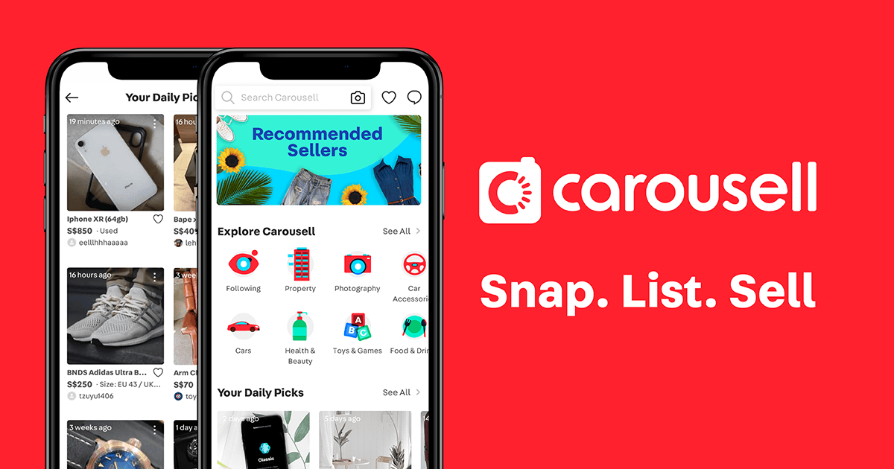

## Carousell

In August of last year, I landed a software engineering stint at Carousell last year. Carousell is a mobile and online C2C marketplace for buying and selling new and pre-loved goods. Carousell is headquartered in Singapore and boasts a strong presence in eight different markets. Additionally, they operate three technology development centres in Singapore, Taiwan and India.

### What I've learnt

During my time as a software engineer at Carousell, I gained valuable insights into operating within highly effective Scrum teams and honing my ability to communicate effectively with non-technical team members in a cross-functional environment.

In my role, I prioritized writing high-quality, well-documented code, ensuring that our software solutions were not only robust but also maintainable. Additionally, I acquired extensive knowledge and hands-on experience with gRPC and protocol buffers, which played a pivotal role in facilitating backend inter-service communication.

In 2022, Carousell's technical stack included:

- Programming Language: Go
- Databases: PostgreSQL
- Caching and Search: Redis, ElasticSearch
- Event Streaming: Kafka
- Communication Protocol: gRPC, ProtoBuf
- Cloud Infrastructure: Google Cloud Platform
- Containerization and Orchestration: Docker, Kubernetes

### Contributions

In the months leading up to my eventual layoff, I was actively involved in two significant projects at Carousell:

#### Migrating Endpoints from Django Monolith to Go Microservices:
As part of our ongoing efforts to enhance scalability and performance, I worked on numerous endpoints in transitioning our system from a Django monolith to Go microservices. This migration aimed to optimize our backend architecture, improve response times, and streamline the development process. This project allowed me to deepen my expertise in Go and microservices architecture.

####  Category Revamp - A Massive Collaborative Endeavor:
The Category Revamp project was a colossal undertaking that engaged more than 100 people from over 10 teams across different functions. The primary objective was to overhaul and modernize the categorization system for product listings. A central challenge was to seamlessly migrate millions of existing listings from their old categories to the newly defined ones, all without causing any significant downtime or disruptions to our platform.

To accomplish this, we collaborated closely with several key teams, including:

- Data Team: Working collaboratively with the Data Team, we developed a sophisticated model designed to intelligently match listings from the old categories to their corresponding new categories.
- Country Managers: As part of our global expansion efforts, we collaborated with Country Managers to ensure the integration of new translations for different markets.
- Search Team: The Search Team played a vital role in updating their search indexes to align with the revamped category structure. 
- Numerous Other Teams: This project required cooperation and coordination with various other teams, all contributing their unique expertise and efforts to make the Category Revamp project a resounding success.

These projects were not only technically challenging but also demanded effective cross-team collaboration and project management skills. Despite the subsequent layoff, I am proud of the valuable contributions I made to these initiatives during my time at Carousell.

### Amazing mentors and managers

During my tenure at Carousell, I was fortunate to meet my mentor, Ben. Ben had a reputation for being a 10X engineer, consistently tackling the most challenging problems. His work not only inspired me but also motivated me to delve into engineering tooling that significantly boosted the productivity of our fellow engineers.

In addition to the invaluable mentorship from Ben, I was fortunate to have exceptional engineering managers, Wilson and Isaac. They exhibited a genuine commitment to my learning and career development while prioritizing my well-being to prevent burnout. In the initial stages of my onboarding process, I was intensely focused on advancing my career to the point where I sometimes overlooked self-care.

>"Work is a marathon, not a sprint."

This was one piece of advice given by my manager that will forever resonate with me. This counsel serves as a constant reminder of the importance of maintaining a healthy work-life balance and pacing oneself for long-term success. 

---
### What happened?

While I cherished my time in my previous working environment, I came to realize that not all good things last forever. On the fateful day of November 30, 2022, I received news that I was one of the 110 individuals who would be laid off from the company.

### Navigating a layoff?

I remember feeling nonchalant about the incident. It didn't come as much of a surprise, considering the waves of layoffs that had preceded it and how I've always been a pragmatic person (although I did feel emotional when returning some company assets at the office).

However, I wasted no time in taking proactive steps to navigate this transitional period. Recognizing the importance of gaining visibility with recruiters and hiring managers, I immediately updated my resume and [notified my LinkedIn network](https://www.linkedin.com/posts/raythx_opentowork-softwareengineering-backend-activity-7004660841568489472-MFlm?utm_source=share&utm_medium=member_desktop) about my situation. 

Understanding that preparing for technical interviews was the next crucial step, I turned to resources like Blind75 to hone my skills and ensure I was well-prepared for the challenges that lay ahead.

### What's next?

I acknowledge that experiences like these are part and parcel of being in the tech industry. However, I have no regrets about my decision to join Carousell. My time there was incredibly enriching, as I had the opportunity to acquire essential technical and interpersonal skills, collaborate with outstanding engineers and managers, and propel my career to new heights. In many ways, you could say that this was a cannon event for me.

I am delighted to share that I've recently secured an exciting offer with Getgo Technologies. In this new role, I'll be tasked with migrating their existing .Net monoliths to Event-Driven Microservices in Go. I'm genuinely enthusiastic about this opportunity and look forward to the extensive learning and growth that I anticipate in this fresh environment.

What would you have done differently after being laid off? I'd love to hear from you on Linkedin! Thanks for reading.